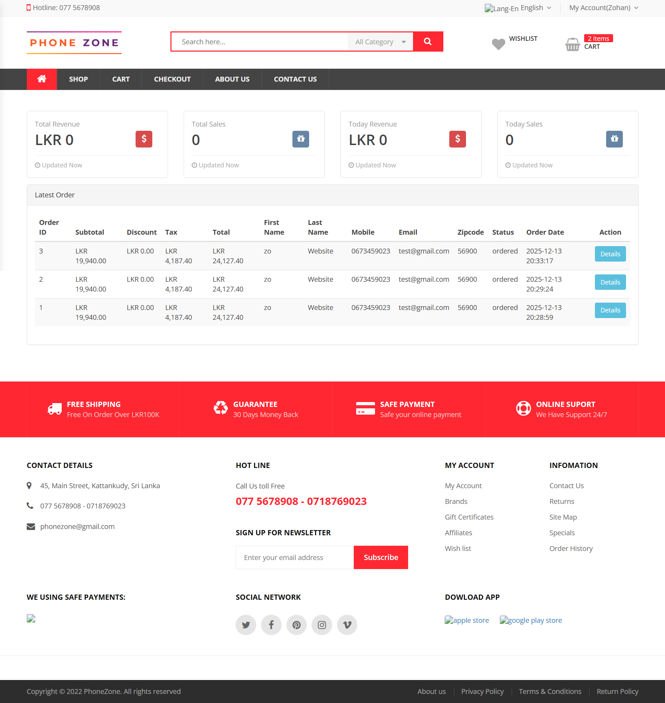
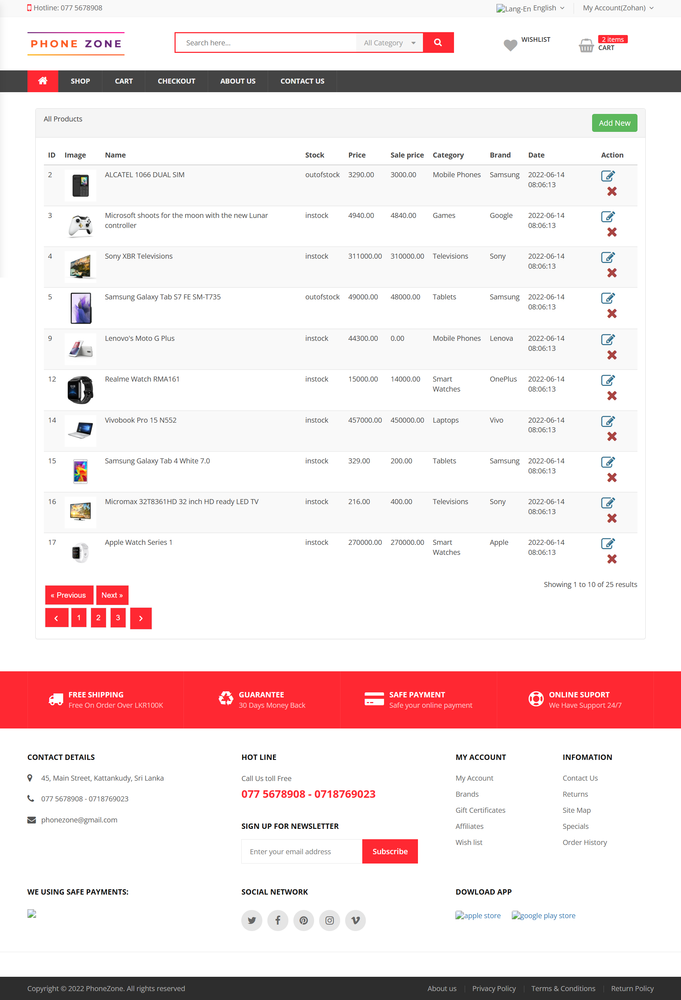
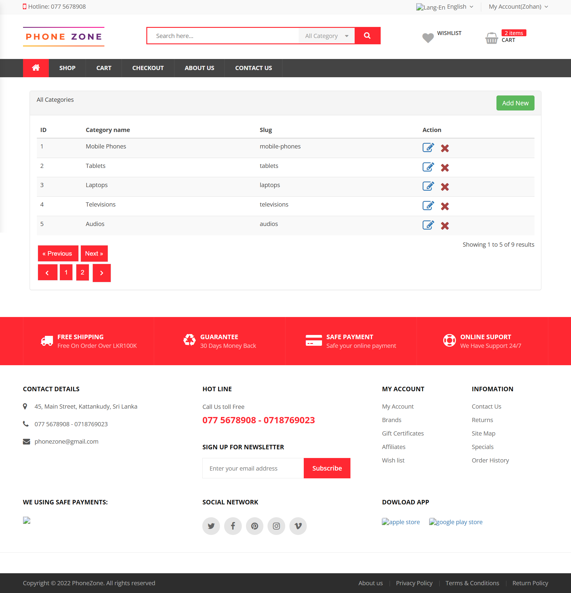
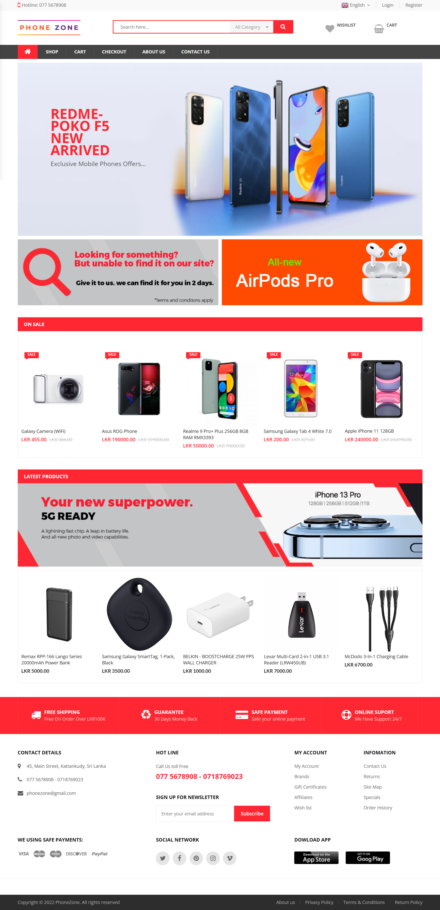
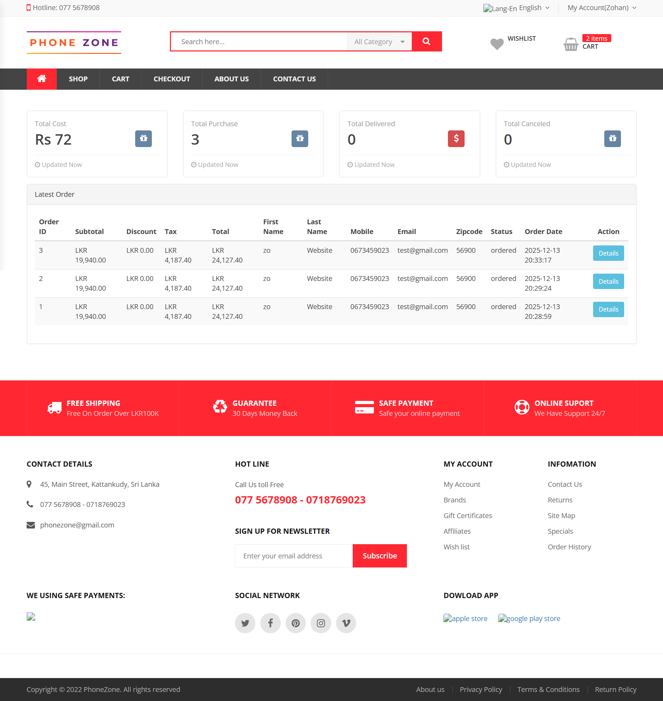
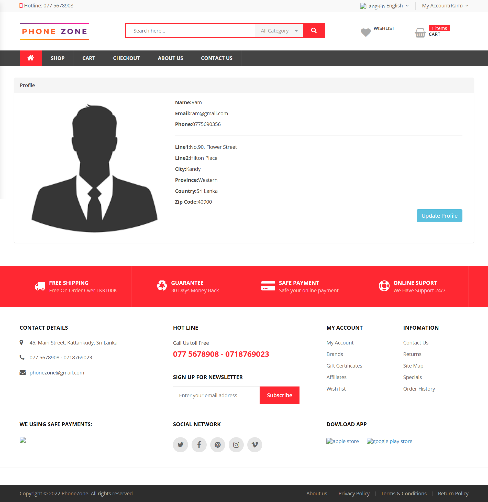
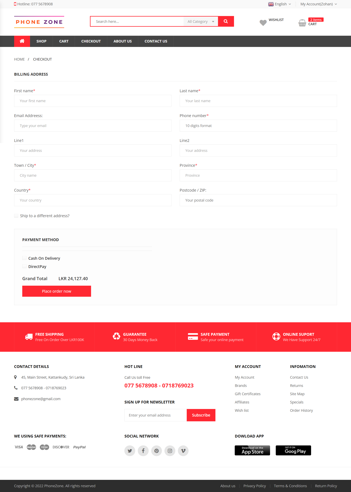
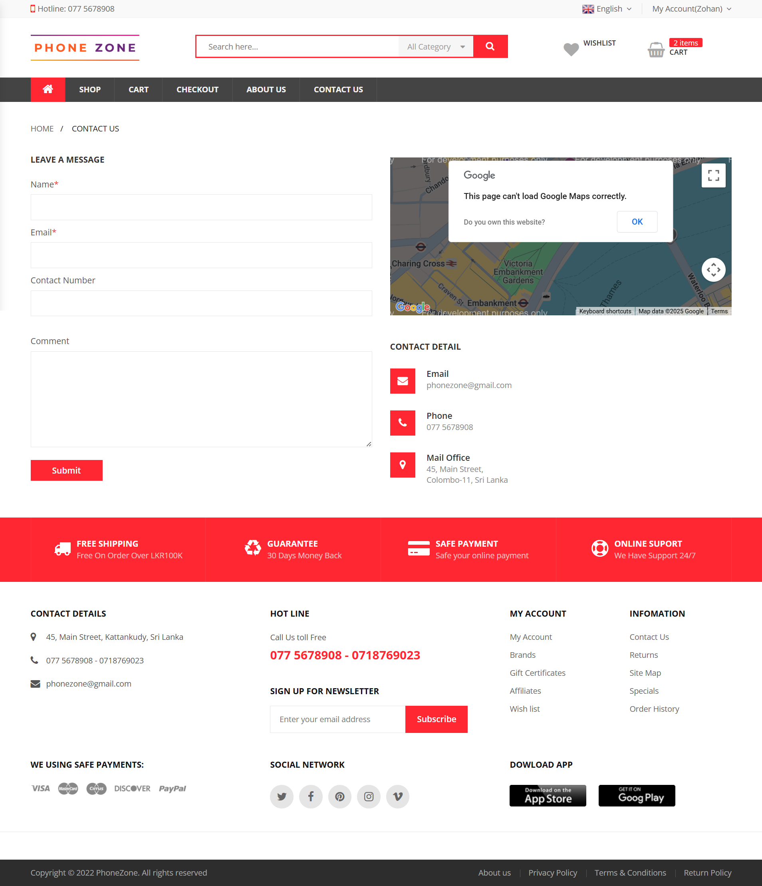
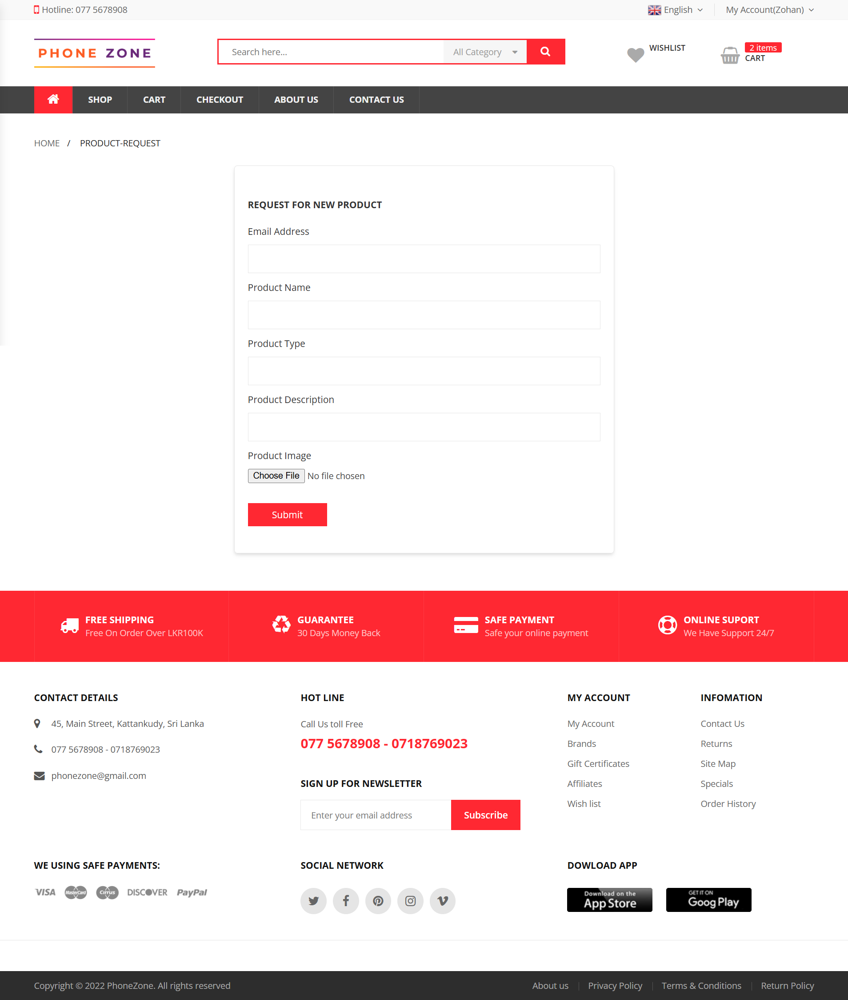

# Ecommerce-PhoneZone-Laravel-Project
=======
This is a simple e-commerce web application developed using Laravel for selling mobile phones, laptops, and related accessories. The project includes an admin panel with product, order, and user management, along with user authentication, a main home page, add-to-cart functionality, and a complete order and checkout process.


---

## Features
- User registration and login
- Product listing and product details
- Add to cart functionality
- Order management
- Admin panel 
- Responsive design

---

## Technologies Used
- Laravel
- PHP
- MySQL
- HTML, CSS, Bootstrap
- JavaScript

---
## Screenshots
Admin Module

Admin Panel


Product Management


Category Manahgement



User Module

Home Page


Shop By Category/Branch(Filter)


User Dashboard


My Profile


Change Password


Shipping Form


About Us


Contact Us


Request For Product



---

## Installation & Setup

1. Clone the repository
```bash
git clone https://github.com/nuharazzak/Ecommerce-PhoneZone-Laravel.git

2. Navigate to the project directory

cd Ecommerce-PhoneZone-Laravel

3. Install dependencies:

composer install
npm install && npm run dev

4. Create .env file

cp .env.example .env

5. Generate application key

php artisan key:generate

6. Configure database in .env

DB_DATABASE=phonezone
DB_USERNAME=your_username
DB_PASSWORD=your_password

7. Run migrations

php artisan migrate

8. Start the server

php artisan serve

---

## Usage
Open browser and go to:

http://127.0.0.1:8000

---
## Author

Fathima
Web Developer | Laravel Developer


